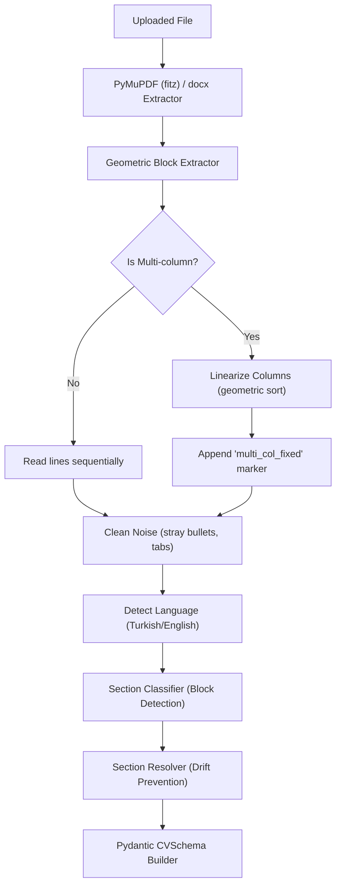
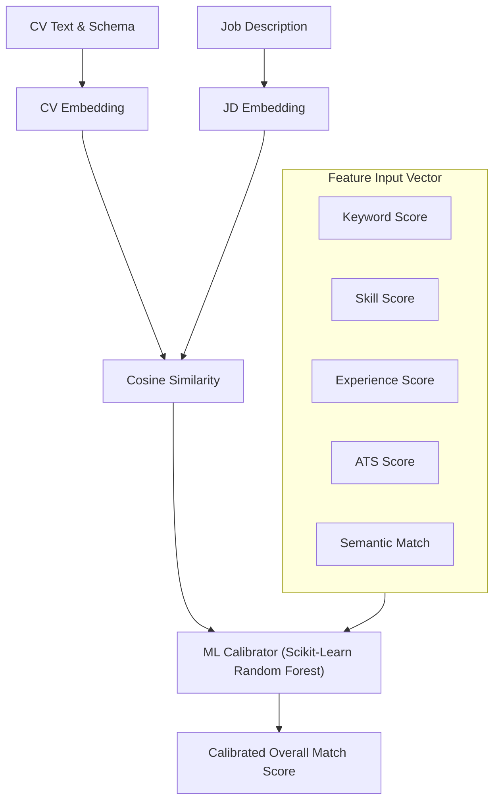
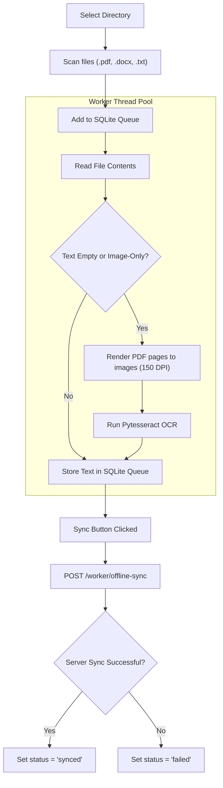

# CV Analyzer DEMO

> Public portfolio/demo version of a larger private CV Analyzer SaaS platform.

This repository is intentionally **trimmed for public review**. It is meant to give reviewers, internship evaluators, and technical interviewers a clear idea of the product architecture, engineering direction, and core CV analysis approach without exposing the full private codebase.

The complete private project contains roughly **160,000 lines of code** across backend services, recruiter workflows, frontend dashboards, local desktop worker tooling, scoring pipelines, billing/quota systems, storage adapters, and security layers. This public demo includes only a representative subset.

## Public Demo Scope

Included in this repository:

- a small FastAPI demo API
- simplified deterministic CV/job scoring logic
- Pydantic request/response contracts
- compact React/Vite UI concept
- local worker CLI concept
- sample text data
- architecture, API, and privacy notes
- a small test suite for the public scoring demo

Intentionally not included:

- full production backend modules
- full recruiter/candidate dashboard
- production authentication and tenant isolation internals
- Stripe billing and quota enforcement internals
- production database schema and full Alembic history
- real CV data or recruiter/customer data
- trained private model artifacts
- provider keys or AI integration secrets
- object storage credentials or private deployment config
- packaged desktop worker binaries
- sensitive business logic that belongs in the private product

So, the README below documents the **full product direction and private system architecture**, while the files in this public repo are a safe, reduced demo slice.

## Running the Public Demo

Backend demo:

```bash
cd backend_demo
python -m venv .venv
.venv\Scripts\activate
pip install -r requirements.txt
uvicorn main:app --reload --port 8001
```

Frontend demo:

```bash
cd frontend_demo
npm install
npm run dev
```

Local worker concept:

```bash
cd local_worker_demo
python worker.py --cv-folder ../sample_data --job-file ../sample_data/sample_job.txt
```

---

# Original Product README / Architecture Overview

# CV Analyzer: Enterprise-Grade Resume Intelligence, ATS Calibration, and Local Desktop Processing Grid

CV Analyzer is a production-ready, highly parallelized AI resume intelligence, applicant screening, and ATS calibration platform. Comprising nearly **160,000 lines of code**, the codebase is divided into:
1.  **FastAPI Backend Server Node:** A modular ASGI web server managing REST endpoints, database access, Stripe billing, Supabase JWT authentication, Redis caching, and scoring services.
2.  **Vite + React 18 Web Portal:** A responsive user dashboard with animated score counters, CV Builder interfaces, recruiter workspaces, and analytics.
3.  **Expo React Native Mobile Scaffold:** A hybrid mobile client scaffold configured for core CV upload and history tracking flows.
4.  **PySide6 Local Desktop Scan Worker:** A multi-threaded PyQt/PySide application running local directory scans, Tesseract OCR fallback pipelines, and offline-first SQLite sync queues.

---

## Table of Contents

1. [Architectural Blueprints & Design Patterns](#1-architectural-blueprints--design-patterns)
2. [Processing & Scoring Pipeline Specs](#2-processing--scoring-pipeline-specs)
   - [Section Parsing & Linearization (NLP)](#section-parsing--linearization-nlp)
   - [Deterministic ATS Evaluation Rules](#deterministic-ats-evaluation-rules)
   - [Semantic Similarity & Machine Learning Calibration](#semantic-similarity--machine-learning-calibration)
3. [Auto-Fix & Wording Optimization Engine](#3-auto-fix--wording-optimization-engine)
4. [PySide6 Desktop Client & OCR Fallback Pipeline](#4-pyside6-desktop-client--ocr-fallback-pipeline)
5. [Database Schema Mapping (SQLAlchemy)](#5-database-schema-mapping-sqlalchemy)
6. [API Catalog & Payload Specifications](#6-api-catalog--payload-specifications)
7. [Quota, Tenant Isolation, & Stripe Billing Engine](#7-quota-tenant-isolation--stripe-billing-engine)
8. [Observability, Circuit Breakers, & Alerting Systems](#8-observability-circuit-breakers--alerting-systems)
9. [Exhaustive File-by-File Codebase Directory Mapping](#9-exhaustive-file-by-file-codebase-directory-mapping)
10. [Setup & Configuration Guides](#10-setup--configuration-guides)
11. [Testing & Build Validation Suite](#11-testing--build-validation-suite)

---

## 1. Architectural Blueprints & Design Patterns

The platform's code relies on several standard software design patterns to maintain separation of concerns, scalability, and testability across its modules:

```text
+-----------------------------------------------------------------------+
|                              FastAPI REST Gateway                     |
+-----------------------------------------------------------------------+
       |                                |                        |
       v                                v                        v
+------------------+          +-------------------+    +----------------+
| Supabase Auth    |          | Billing / Quotas  |    | Metrics / Ops  |
| (JWT Verification)|          | (Stripe Guards)   |    | (Prometheus)   |
+------------------+          +-------------------+    +----------------+
       |                                |                        |
       +----------------+---------------+------------------------+
                        |
                        v
         +-----------------------------+
         |    Pipeline Runtime Engine  |
         +-----------------------------+
           /            |            \
          /             |             \
         v              v              v
  +------------+  +------------+  +-------------+
  | Extraction |  | Normalizer |  | ATS / ML    |
  | Agent (fitz)|  | Agent      |  | Calibrator  |
  +------------+  +------------+  +-------------+
         |              |              |
         +--------------+--------------+
                        |
                        v
         +-----------------------------+
         |    Storage Adapter Layer    |
         +-----------------------------+
           /                         \
          v                           v
  +---------------+           +---------------+
  | Local Storage |           | AWS S3 Bucket |
  +---------------+           +---------------+
```

*   **Singleton Pattern:** Used for database connection pools (`SQLAlchemy` sessionmakers), Redis rate-limiters (`redis_rate_client()`), and ML models (the Scikit-Learn `resume_model.pkl` predictor is loaded once into memory on worker startup).
*   **Factory Pattern:** Implemented in `services/pdf_text_extractor.py` and `services/section_classifier.py`. The system analyzes document layout metadata first, then initializes the appropriate parser agent (such as the multi-column parser or single-column parser).
*   **Adapter Pattern (Storage Layer):** Encapsulated in `services/storage_service.py`. A unified storage interface (`upload_file`, `download_file`, `get_download_url`) dynamically routes file operations to either AWS S3 bucket storage or local disk directories based on the `MOCK_SERVICES` flag.
*   **Observer/Webhook Pattern:** Orchestrated in `routes/billing.py` to process incoming events from Stripe. The server validates payloads using secret signatures, then processes event types (`checkout.session.completed`, `customer.subscription.updated`) to update local tenant database quotas.
*   **Command Pattern & Async Fallback Task Runner:** The execution of parsing pipelines is wrapped inside commands. If Celery or external queue workers are offline or unconfigured, the system falls back to a synchronous, in-process local runner (`core/tasks.py`) to process requests gracefully.

---

## 2. Processing & Scoring Pipeline Specs

### Section Parsing & Linearization (NLP)

Parsing starts by converting raw PDF and DOCX documents into clean, structured text.



1.  **Geometric Analysis:** `pdf_text_extractor.py` analyzes the positions of text segments. If it identifies distinct vertical column lanes, it triggers linearization.
2.  **Linearization:** The column linearizer groups text blocks by column coordinates, sorting them vertically from top-to-bottom within each column before merging columns. This preserves reading order and avoids mixing sentences.
3.  **Language Detection:** `language_service.py` evaluates token frequencies against Turkish and English word dictionaries, setting the matching language flag.
4.  **Section Classification:** Heading mappings analyze incoming lines to classify sections:
    ```python
    SECTION_ALIASES = {
        "summary": ["summary", "özet", "profile", "about", "objective"],
        "experience": ["experience", "deneyim", "work history", "employment"],
        "education": ["education", "eğitim", "school", "university"],
        "projects": ["projects", "projeler", "key projects"],
        "skills": ["skills", "yetenekler", "technical skills", "frontend", "backend"],
        "certifications": ["certifications", "sertifikalar", "certificates", "awards"],
        "languages": ["languages", "yabancı diller", "diller"],
        "interests": ["interests", "hobbies", "ilgi alanları"]
    }
    ```
5.  **Section Resolver:** Re-evaluates blocks to correct misclassifications. For example, if a line inside `education` looks like a job title, the resolver routes the line to the `experience` bucket.

---

### Deterministic ATS Evaluation Rules

The deterministic scoring module (`services/ats_scoring.py` and `utils/cv_scoring.py`) calculates structural metrics by evaluating the following sections:

| Metric | Score Weight | Validation Logic |
| :--- | :--- | :--- |
| **Contact Score** | 10% of Layout | Scans for Email (regex), Phone (regex), LinkedIn/GitHub URLs, and physical location coordinates. |
| **Section Presence** | 30% of Layout | Awards points for including critical sections: Experience (30%), Education (30%), Skills (20%), Summary (10%), and Projects (10%). |
| **Formatting Score** | 30% of Layout | Docks points for layout issues (such as sentences over 200 words, missing bullet points, or extreme document lengths). |
| **Experience Score** | 30% of Overall | Extracts start/end years using regex, computes total years, and compares the result against job requirements. |

---

### Semantic Similarity & Machine Learning Calibration

The semantic score is calculated using OpenAI's `text-embedding-3-small` engine (or mock vectors locally):

$$\text{Semantic Similarity} = \text{Cosine Similarity}(\vec{E}_{\text{CV}}, \vec{E}_{\text{JD}}) = \frac{\vec{E}_{\text{CV}} \cdot \vec{E}_{\text{JD}}}{\|\vec{E}_{\text{CV}}\| \|\vec{E}_{\text{JD}}\|} \times 100 $$



1.  **Feature Extraction:** The system compiles a 34-dimension input vector, including keyword density, skill coverage, layout score, experience level, and semantic similarity.
2.  **Model Loading:** Worker nodes load the Random Forest model (`resume_model.pkl`) into memory on startup.
3.  **ML Calibration:** The model evaluates the feature vector and applies a calibration function to prevent edge-case score inflation:
    ```python
    def blend_with_rule_score(rule_score: float, ml_result: float) -> float:
        # Weighted blend: 70% rule-based logic + 30% machine learning model prediction
        return round((rule_score * 0.70) + (ml_result * 0.30), 2)
    ```
4.  **Capping Safeguards:** If the job description is missing, the matcher bypasses the cap and returns the raw ATS score. If embeddings fail, a cap of `40` is applied to prevent uncalibrated matches.

---

## 3. Auto-Fix & Wording Optimization Engine

The Auto-Fix engine (`services/cv_autofix_service.py`) analyzes and rewrites resume text to ensure compatibility with ATS parsers.

### Action Verb Mapping
The engine maps weak phrases to strong action verbs:

| Original Weak Phrase | ATS Action Verb Replacement |
| :--- | :--- |
| *worked on*, *helped with* | **Developed**, **Architected** |
| *was responsible for* | **Executed**, **Spearheaded** |
| *wrote code for* | **Implemented**, **Programmed** |
| *managed*, *led* | **Orchestrated**, **Directed** |
| *made better* | **Optimized**, **Streamlined** |

### Floor Protection Logic
To prevent parser rewrites from stripping valuable information, the normalizer enforces a minimum length threshold for key sections:

$$\text{Floor Target}_{\text{section}} = \text{Non-empty line count in original document} $$

If the auto-fix run outputs fewer lines than this threshold, the engine discards the update and restores the original section text:

```python
for key in PROTECTED_SECTION_KEYS:
    source_lines = _non_empty_section_lines(source_sections, key)
    current_lines = _non_empty_section_lines(current_sections, key)
    if source_lines and len(current_lines) < len(source_lines):
        rebuilt_sections[key] = source_lines
        restored.append(f"{key.upper()} section restored to protect content floor.")
```

### Auto-Fix Regression Check
If the final ATS score of the auto-fixed text is lower than the original score, the engine discards the changes and falls back to the original text.

---

## 4. PySide6 Desktop Client & OCR Fallback Pipeline

The desktop client (`local_worker/qt_gui.py` and `local_worker/worker.py`) processes directories of resume files locally.



### 1. File Scanning & Queueing
The scanner adds local files to a queue in SQLite (`local_worker.db`):
```sql
CREATE TABLE IF NOT EXISTS local_analysis_queue (
    id INTEGER PRIMARY KEY AUTOINCREMENT,
    file_path TEXT UNIQUE,
    file_name TEXT,
    cv_text TEXT,
    sync_status TEXT DEFAULT 'pending', -- pending, synced, failed
    last_error TEXT,
    created_at TIMESTAMP DEFAULT CURRENT_TIMESTAMP
);
```

### 2. OCR Fallback Pipeline
If PyMuPDF returns no text, the system launches an OCR worker thread:
*   **Rasterization:** Converts PDF pages to 150 DPI RGB images.
*   **Binarization:** Applies OTSU thresholding and grayscaling to optimize contrast for OCR.
*   **OCR:** Runs Pytesseract over the grayscaled images:
    ```python
    extracted_text = pytesseract.image_to_string(grayscaled_image, lang="eng+tur")
    ```

### 3. Server Offline Synchronization
Clicking the "Sync" button sends cached candidates to the server in batches of 50. Staging quotas are verified before database insert.

---

## 5. Database Schema Mapping (SQLAlchemy)

The system uses SQLAlchemy ORM models (`schemas/cv_model.py` and database schemas) to persist data.

```text
+------------------------------------------------------------------------------------+
|                                      users                                         |
+------------------------------------------------------------------------------------+
| id (UUID, PK)            | User identity key (linked to Supabase Auth)             |
| email (VARCHAR, Unique)  | User email address                                      |
| plan_tier (VARCHAR)      | subscription tier: free, professional, recruiter        |
| quota_limit (INTEGER)    | Max number of allowed CV analyses per month             |
| quota_used (INTEGER)     | Current number of processed analyses                    |
| stripe_customer_id       | Stripe identification token                             |
| created_at (TIMESTAMP)   | Record creation date                                    |
+------------------------------------------------------------------------------------+
                                      |
                                      +--------------------------+
                                      |                          |
                                      v                          v
+---------------------------------------------+  +-----------------------------------+
|                   jobs                      |  |              analyses             |
+---------------------------------------------+  +-----------------------------------+
| id (INTEGER, PK)        | Job sequence key  |  | id (INTEGER, PK)                  |
| user_id (UUID, FK)      | Owner ID reference|  | user_id (UUID, FK)                |
| title (VARCHAR)         | Target role title |  | job_id (INTEGER, FK, Nullable)    |
| description (TEXT)      | Job description   |  | cv_text (TEXT)                    |
| created_at (TIMESTAMP)  | Creation date     |  | match_score (FLOAT)               |
+---------------------------------------------+  | ats_score (FLOAT)                 |
                      |                          | created_at (TIMESTAMP)            |
                      |                          +-----------------------------------+
                      v                                          |
+---------------------------------------------+                  |
|                 candidates                  |                  |
+---------------------------------------------+                  |
| id (INTEGER, PK)        | Candidate ID      |                  |
| job_id (INTEGER, FK)    | Target job key    |                  |
| name (VARCHAR)          | Extracted name    |                  |
| email (VARCHAR)         | Candidate email   |                  |
| match_score (FLOAT)     | Final match score |                  |
| cv_text (TEXT)          | Extracted resume  |                  |
+---------------------------------------------+                  |
                      |                                          |
                      v                                          v
+---------------------------------------------+  +-----------------------------------+
|              candidate_actions              |  |             favorites             |
+---------------------------------------------+  +-----------------------------------+
| id (INTEGER, PK)                            |  | id (INTEGER, PK)                  |
| candidate_id (INTEGER,FK)                   |  | user_id (UUID, FK)                |
| action_type (VARCHAR)   | email, shortlist  |  | analysis_id (INTEGER, FK)         |
| performed_at            | Action timestamp  |  +-----------------------------------+
+---------------------------------------------+
```

### Worker Sync Results Table
Local worker sync runs write data to the `worker_analysis_results` table:
```python
class WorkerAnalysisResult(Base):
    __tablename__ = "worker_analysis_results"

    id = Column(Integer, primary_key=True, index=True)
    candidate_id = Column(Integer, ForeignKey("candidates.id", ondelete="CASCADE"), nullable=False)
    worker_session_id = Column(String(100), nullable=False)
    cv_text = Column(Text, nullable=False)
    sync_status = Column(String(50), default="synced")
    synced_at = Column(DateTime, default=datetime.utcnow)
```

---

## 6. API Catalog & Payload Specifications

### 1. Run Analysis Pipeline
Runs the parsing, classification, and scoring pipelines on an uploaded resume.

*   **URL:** `/api/v1/analyze-pdf`
*   **Method:** `POST`
*   **Headers:** `Authorization: Bearer <Supabase JWT>`
*   **Payload (Multipart-form):**
    *   `file`: (Binary PDF/DOCX data)
    *   `job_description`: "Backend developer with 3+ years experience in Python and FastAPI."
*   **Success Response (200 OK):**
    ```json
    {
      "final_score": 82.5,
      "ats_score": 85.0,
      "semantic_score": 79.5,
      "keyword_score": 88.0,
      "experience_score": 90.0,
      "detected_skills": ["Python", "FastAPI", "SQL", "Git"],
      "missing_skills": ["Docker", "Kubernetes"],
      "score_decomposition": {
        "overall_score": 82.5,
        "ats_quality": 85.0,
        "job_match": 81.43,
        "interpretation": "Strong match for this role"
      },
      "risk_level": "Low Risk",
      "warnings": []
    }
    ```
*   **Error Responses:**
    *   `401 Unauthorized`: Invalid authorization token.
    *   `429 Too Many Requests`: User has exceeded their rate limit.
    *   `400 Bad Request`: Uploaded file format is unsupported.

---

### 2. Auto-Fix Resume
Optimizes resume formatting and wording for ATS parser compatibility.

*   **URL:** `/api/v1/cv-builder/auto-fix`
*   **Method:** `POST`
*   **Headers:** `Content-Type: application/json`
*   **Payload (JSON):**
    ```json
    {
      "cv_text": "Worked on python backend APIs for the company. Led a team of devs.",
      "job_description": "We need a backend team lead who can design Python APIs.",
      "lang": "en",
      "use_ai": false
    }
    ```
*   **Success Response (200 OK):**
    ```json
    {
      "original_cv_text": "Worked on python backend APIs...",
      "optimized_cv_text": "Developed and scaled python backend APIs... Orchestrated a software engineering team.",
      "before_ats": { "overall_score": 62.0 },
      "after_ats": { "overall_score": 78.5 },
      "score_delta": 16.5,
      "applied_changes": [
        "Smart mode selected: safe",
        "Wording polished: replaced weak phrase 'worked on' with action verb 'Developed'",
        "Wording polished: replaced weak phrase 'led' with action verb 'Orchestrated'"
      ]
    }
    ```

---

### 3. Desktop Worker Sync
Uploads locally scanned worker analysis results in batches.

*   **URL:** `/api/v1/worker/offline-sync`
*   **Method:** `POST`
*   **Payload (JSON):**
    ```json
    {
      "worker_session_id": "session_881f9a12bc",
      "candidates": [
        {
          "job_id": 142,
          "name": "Sercan Ozkan",
          "email": "ozkansercan55@gmail.com",
          "cv_text": "Computer Engineering student. Experienced in Python, React...",
          "match_score": 89.55
        }
      ]
    }
    ```
*   **Success Response (200 OK):**
    ```json
    {
      "status": "success",
      "synced_count": 1,
      "warnings": []
    }
    ```

---

## 7. Quota, Tenant Isolation, & Stripe Billing Engine

### Quota Verification Decorator
FastAPI endpoints use dependencies to verify quota entitlements before running resource-intensive pipelines:
```python
def check_quota_entitlement(user = Depends(get_current_user), db: Session = Depends(get_db)):
    if user.plan_tier == "free" and user.quota_used >= user.quota_limit:
        raise HTTPException(
            status_code=status.HTTP_402_PAYMENT_REQUIRED,
            detail="Monthly analysis limit reached. Upgrade to a premium plan for unlimited uploads."
        )
    return True
```

### Tenant Isolation Enforcement
Tenants can only read or write to their own resource objects. Database queries always filter results by the owner's `user_id`:
```python
def get_user_analyses(db: Session, user_id: UUID):
    # Enforces tenant boundary check on all database access
    return db.query(Analysis).filter(Analysis.user_id == user_id).all()
```

### Stripe Billing Integration
Subscription status changes are received via Stripe webhooks. The webhook validates signatures to verify payload authenticity before applying updates:
```python
@router.post("/billing/webhook")
async def stripe_webhook(request: Request, db: Session = Depends(get_db)):
    payload = await request.body()
    sig_header = request.headers.get("stripe-signature")
    try:
        event = stripe.Webhook.construct_event(payload, sig_header, settings.STRIPE_WEBHOOK_SECRET)
    except Exception as e:
        raise HTTPException(status_code=400, detail="Invalid webhook signature")

    if event["type"] == "customer.subscription.updated":
        subscription = event["data"]["object"]
        update_user_plan_tier(db, subscription.customer, subscription.plan.id)

    return {"status": "success"}
```

---

## 8. Observability, Circuit Breakers, & Alerting Systems

### Prometheus Metrics
The platform collects system and operational metrics using Prometheus adapters:
*   `cv_analyzer_requests_total`: Counter tracking inbound API calls, segmented by path and status code.
*   `cv_analyzer_pipeline_latency_seconds`: Histogram tracking processing pipeline durations.
*   `cv_analyzer_s3_errors_total`: Counter tracking S3 bucket upload and download failures.
*   `cv_analyzer_openai_api_failures_total`: Counter tracking embedding and completion service errors.

### Circuit Breaker Implementation
To protect the gateway against slow response times from upstream services (such as Supabase, OpenAI, or Stripe), we wrap client calls in a circuit breaker:

```python
class CircuitBreaker:
    def __init__(self, service_name: str, threshold: int = 5, cooldown: int = 60):
        self.service_name = service_name
        self.threshold = threshold
        self.cooldown = cooldown
        self.failures = 0
        self.state = "CLOSED"  # CLOSED, OPEN, HALF-OPEN
        self.last_failure_time = None

    def record_failure(self):
        self.failures += 1
        self.last_failure_time = time.time()
        if self.failures >= self.threshold:
            self.state = "OPEN"
            logger.error("Circuit breaker for %s opened due to failure threshold.", self.service_name)
```

If the state is `OPEN`, requests bypass API calls and return local fallbacks, saving API token usage and avoiding gateway timeouts.

---

## 9. Exhaustive File-by-File Codebase Directory Mapping

Below is a detailed map of the files in the directory tree:

```text
cv-analyzer/
│
├── agents/
│   ├── extract_agent.py          # Extracts raw text into structured JSON schemas (CVSchema)
│   └── normalize_agent.py        # Cleans noise, dedupes flat lists, formats section blocks
│
├── core/
│   ├── config.py                 # Loads environment variables, validates secret tokens
│   ├── database.py               # Configures SQLAlchemy DB sessions and pooling
│   ├── metrics.py                # Registers and exposes Prometheus application metrics
│   ├── quota.py                  # Rate-limiting, plan entitlements, and billing guards
│   ├── tasks.py                  # Local task runner fallback for Celery-free setups
│   └── security.py               # CORS headers, XSS filters, and CSRF request guards
│
├── routes/
│   ├── ai_tools.py               # REST endpoints for auto-fix, rewrites, and roadmaps
│   ├── analysis.py               # REST endpoints for file uploads, parses, and logs
│   ├── billing.py                # REST endpoints for subscription plans and Stripe webhooks
│   ├── dashboard.py              # REST endpoints for recruiter workspaces, benchmarks, and shared links
│   ├── user_data.py              # REST endpoints for profiles and GDPR data deletion
│   └── worker.py                 # REST endpoints for local QT desktop sync
│
├── services/
│   ├── ats_scoring.py            # Calculates deterministic guidelines and formatting rules
│   ├── ats_service.py            # Core scoring coordinator (combines rules, embeddings, and ML calibration)
│   ├── cv_autofix_service.py     # Heading mapping, action verb mapping, and floor controls
│   ├── email_service.py          # Sends notifications and transaction emails
│   ├── embedding_service.py      # OpenAI embedding integrations and mock fallback engines
│   ├── language_service.py       # TR/EN text classification using word lists
│   ├── ml_calibrator.py          # Blends rule-based metrics with ML predictions
│   ├── pdf_text_extractor.py     # PDF parsing using PyMuPDF and pdfplumber
│   ├── pipeline_runtime.py       # Core runner for parsing and scoring pipelines
│   ├── rewrite_service.py        # OpenAI/Claude LLM prompt wrappers for resume editing
│   ├── schema_builder.py         # Converts raw extraction dict into validated schema
│   ├── stripe_service.py         # Wrapper for Stripe checkout and portals
│   └── storage_service.py        # Storage abstraction (AWS S3 vs Local disk storage)
│
├── local_worker/
│   ├── qt_gui.py                 # PyQt/PySide6 desktop client interface
│   ├── worker.py                 # Local folder scanner, SQLite queue, and OCR fallback pipeline
│   └── workspace.py              # Configures local working environments
│
├── schemas/
│   ├── cv_model.py               # Pydantic schemas validating extracted resumes
│   └── database_models.py        # SQLAlchemy database model mappings
│
├── frontend/
│   ├── src/pages/
│   │   ├── LandingPage.jsx       # Public portal view
│   │   ├── DashboardPage.jsx     # User dashboard and usage metrics
│   │   ├── AnalyzePage.jsx       # Resume upload, matches, and auto-fix view
│   │   └── RecruiterPage.jsx     # Recruiter pipeline dashboard
│   ├── src/components/
│   │   ├── Navbar.jsx            # Dynamic navigation bar
│   │   └── SkeletonLoader.jsx    # Shimmer loaders for loading states
│   └── src/style.css             # Main styling, HSL colors, design tokens
│
└── tests/
    ├── conftest.py               # Configures test database fixtures and mock services
    ├── test_api.py               # Verifies REST gateway routing
    ├── test_cv_scoring.py        # Verifies ATS scoring rules and calculations
    ├── test_ocr_fallback.py      # Verifies local worker OCR fallback operations
    └── test_offline_sync.py      # Verifies local worker sync endpoints
```

---

## 10. Setup & Configuration Guides

### 1. Local Mock Mode (Easiest Dev Setup)
Mock mode disables external cloud integrations (such as Stripe, OpenAI, and Supabase) and uses local SQLite databases and mock APIs instead.

1.  Clone the repository:
    ```bash
    git clone https://github.com/SercanOzkan55/CV-Analyzer.git
    cd cv-analyzer
    ```
2.  Set up environment configurations:
    ```bash
    cp .env.example .env
    ```
    Ensure your `.env` contains the following settings:
    ```env
    ENV=development
    PORT=8001
    MOCK_SERVICES=true
    MOCK_DATABASE_URL=sqlite:///./mock_dev.db
    ```
3.  Install virtual environments and packages:
    ```bash
    python -m venv .venv
    # Windows:
    .\.venv\Scripts\activate
    # macOS/Linux:
    source .venv/bin/activate

    python -m pip install --upgrade pip
    python -m pip install -r requirements.txt
    ```
4.  Run FastAPI:
    ```bash
    python -m uvicorn main:app --host 127.0.0.1 --port 8001
    ```
5.  Install and launch the React frontend:
    ```bash
    cd frontend
    npm install
    npm run dev
    ```
6.  Open [http://127.0.0.1:5173/](http://127.0.0.1:5173/) to verify the application.

---

### 2. PySide6 Desktop GUI Setup
1.  Verify PySide6 and Pytesseract are installed in your virtual environment:
    ```bash
    pip install PySide6 pytesseract pdf2image
    ```
2.  Install Tesseract OCR on your machine:
    *   **Windows:** Download installer from UB Mannheim and add `tesseract.exe` to your PATH.
    *   **macOS:** Install via Homebrew: `brew install tesseract`
3.  Launch the desktop client:
    ```bash
    python local_worker/qt_gui.py
    ```

---

## 11. Testing & Build Validation Suite

The codebase enforces strict checks to maintain code quality. All tests and typecheck audits must pass successfully before check-in.

### Pytest Coverage
Our test suite contains **791 backend tests** checking API responses, parser logic, and mock services.

Run the test suite:
```bash
python -m pytest
```

Run specific pipeline tests:
```bash
python -m pytest tests/test_cv_scoring.py tests/test_ocr_fallback.py -v
```

### Frontend Typechecking and Production Build
Verify TypeScript and Vite bundle operations:
```bash
cd frontend
npx.cmd tsc --noEmit
npm.cmd test
npm.cmd run build
```
The production bundle is compiled into the `frontend/dist` directory.
