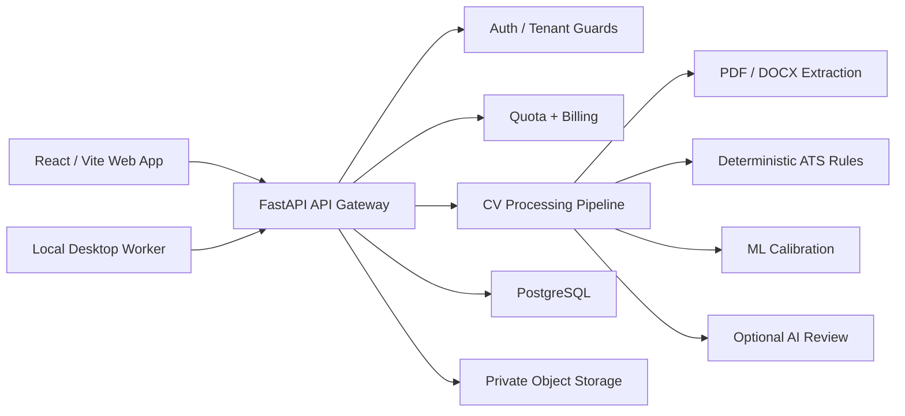
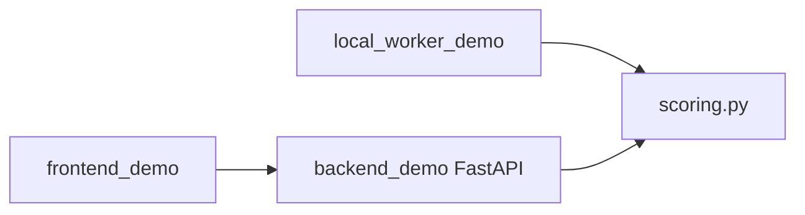

# Architecture Overview

The private CV Analyzer system is organized as a modular SaaS platform. This public demo only keeps a small representative slice.

## Private Production Architecture

## Public Demo Architecture

## Important Production Features Not Published

- tenant-scoped recruiter workspaces
- secure worker key lifecycle
- row-level quota accounting
- audit logging and secret redaction
- storage signed URL isolation
- production ML feature extraction
- OpenAI/provider fallback controls
- full frontend dashboard and local worker desktop UI

The public demo focuses on product direction and simplified scoring mechanics only.